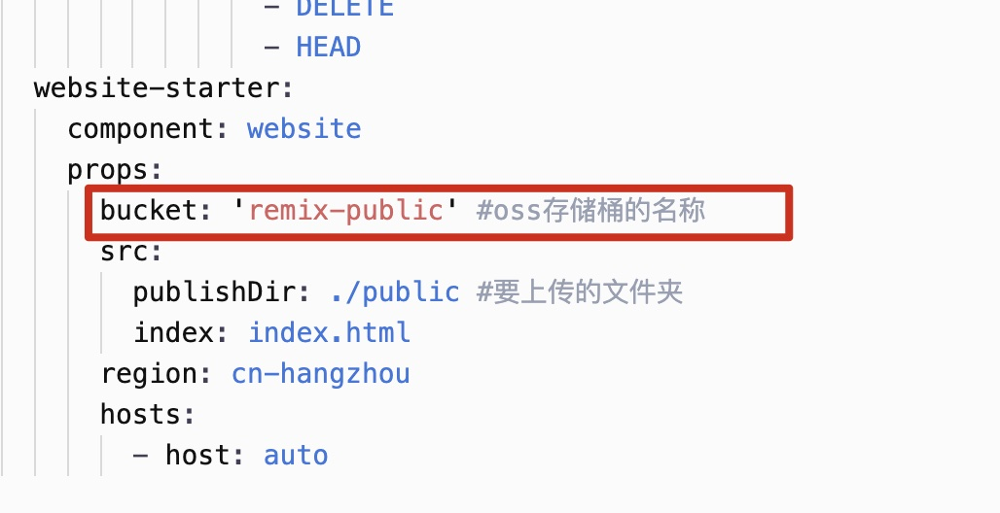
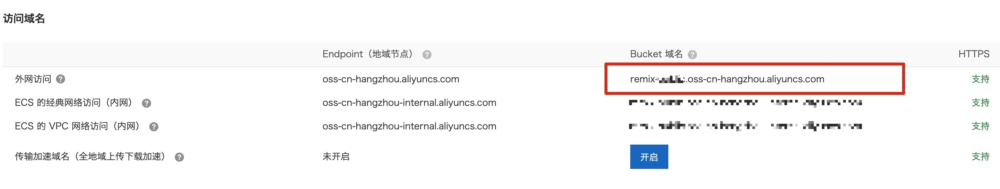

# 欢迎使用remix

- [Remix Docs](https://remix.run/docs)

## 使用阿里云FC函数计算+oss存储桶实现remix全栈应用！！！！

示例网站 [ali.jiahuiblog.com](http://ali.jiahuiblog.com)

## 开发

```
cd src
npm i
```

## 发布

### 配置oss对象存储桶

添加存储桶

点击左侧`权限管理`修改存储桶的权限为公共读，如果有自定义域名的话，跨域设置来源为自定义域名，没有的话就设置为`*`方便测试


### 修改你要部署的静态文件夹public的路径:

设置`s.yaml`文件最下方`bucket` oss存储桶的名称



编辑`remix.config.js`文件中的`publicPath`位置，设置为oss存储桶的地址


接着进行构建命令

```sh
npm run build
```

然后执行发布命令

```sh
s deploy
```

查看命令行的地址，即可访问部署好的应用


