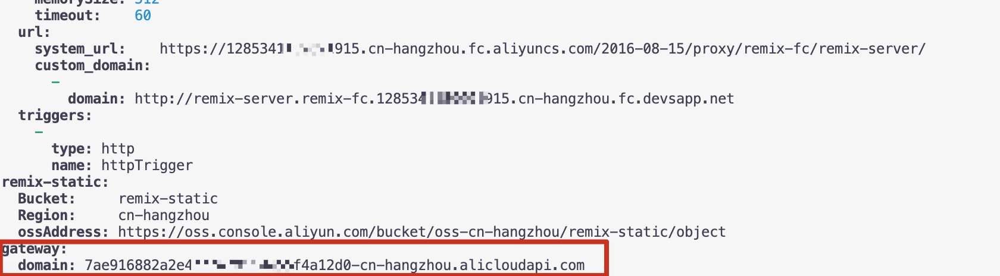
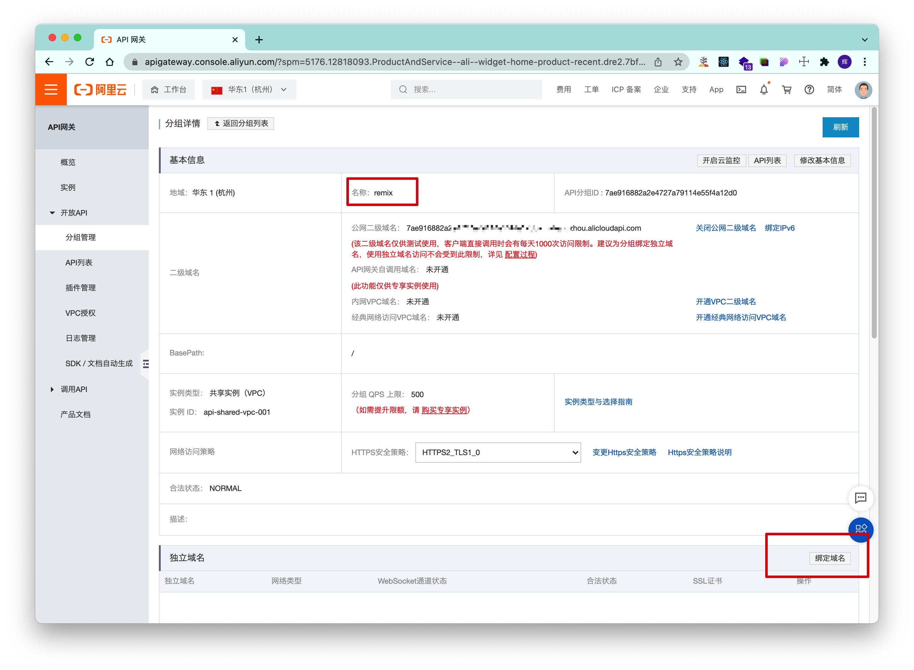
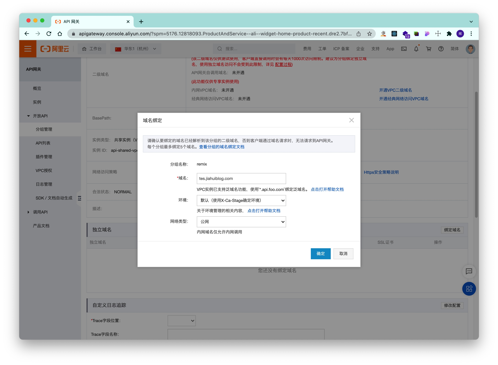
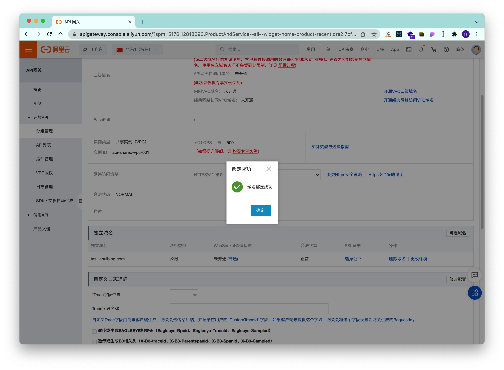
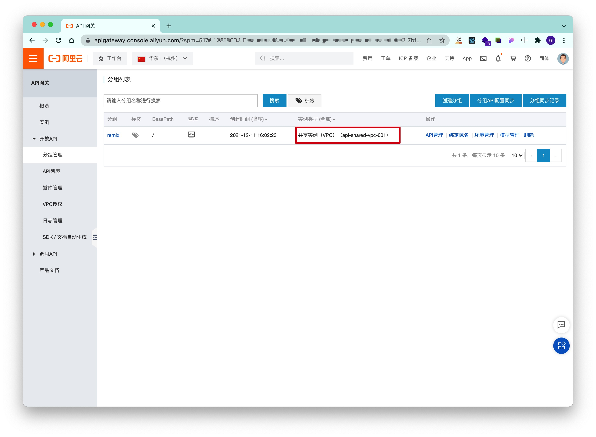
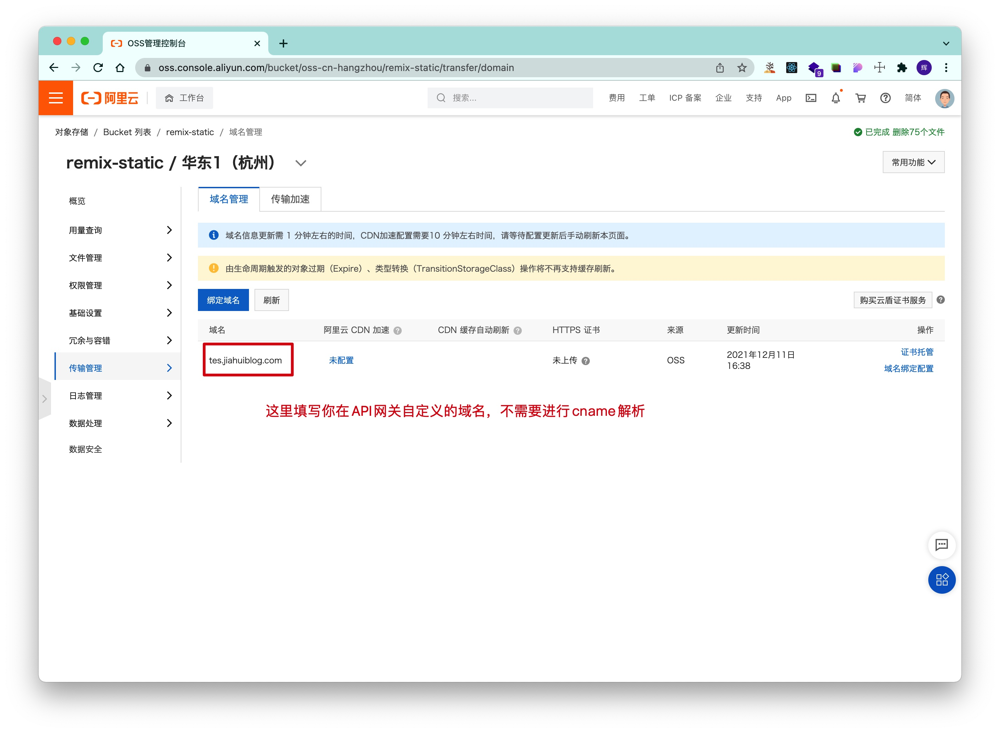

# 欢迎使用remix

- [Remix Docs](https://remix.run/docs)

## 使用阿里云FC函数计算+oss存储桶部署remix全栈应用！！！！

示例网站 [ali.jiahuiblog.com](http://ali.jiahuiblog.com)

## 开发

```
cd src

npm i

构建

npm run build

```

## 发布

安装serverless Devs
```
npm install -g @serverless-devs/s

添加阿里云账号
s config add
```

补充s.yaml文件信息


必填accountID和bucketName和fc的baseUrl，注意bucketName名字要唯一


然后执行部署命令，可以看到gateway临时的二级域名(我这里没有添加自定义域名。注意，这个临时的二级域名不可以访问，需要绑定自定义域名)

```sh
s deploy
```


绑定自定义域名

将刚才的gateway下的domain复制一下，添加cname解析，比如我这里使用DNSPOD将`tes.jiahuiblog.com`解析到`7a*****`这个域名上面

然后在apigateway页面找到remix分组绑定咱们解析的域名


如果解析成功了，就会提示绑定成功,如果你是共享示例(一般都是),请看注意事项，按注意事项的操作了之后就可以访问了

## 注意事项
1. 如果你是共享实例,请在oss存储桶那边添加你的自定义域名(比如我绑定apigateway的域名为test.jiahuiblog.com,那就把这个域名直接添加到这个存储桶这里就好了)，不需要进行cname解析，不进行这一步操作就会无法访问静态资源。




